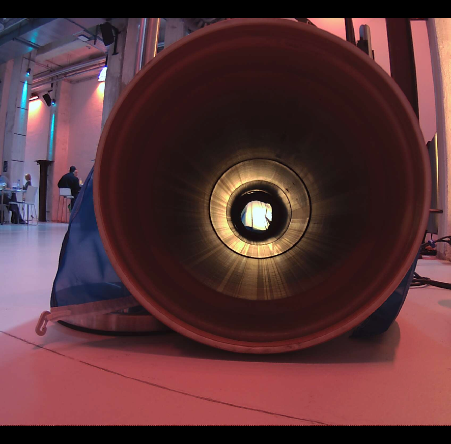

# Hack4Pott
This was done during 24hs at the hackathon #Hack4Pott.

In cocking plants, chimney get constricted by deposits, which hinders their performance. Thus they need to be maintained which is a time-consuming process.
The detection of constrictions is helpful to do the maintainence on the right time.

Segmentation of constrictions in conking plant chemneys.
Be aware that the images in segmentation_results are not showing much with a normal image viewer, cause they only contain 1 and 2 as values. Look at the Examples below to get a glimpse of the performance. This was achieved by using only 23 labeled images as input.

  

    
    
Raw Image of an constricted pipe model

  

  

    
    
Segmentation of the constriction and the pipe in the image

  

